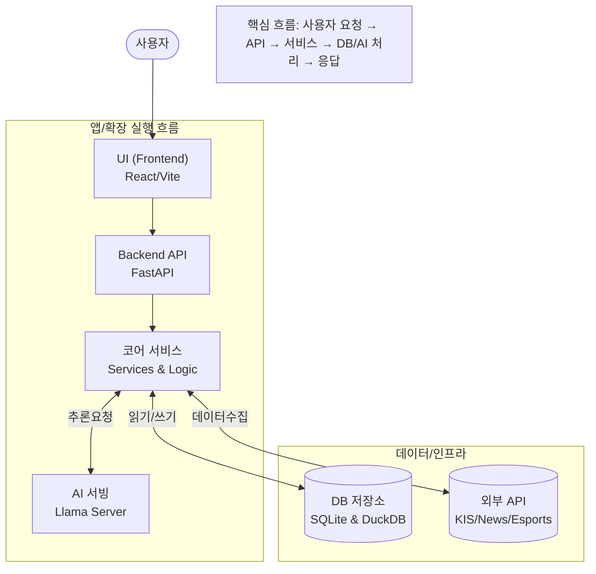

# 📊 프로젝트 평가 보고서 (Project Evaluation Report)

이 보고서는 `personal-portfolio` 프로젝트의 현재 상태, 코드 품질, 아키텍처, 리스크를 종합적으로 평가하고 개선 방향을 제시합니다.

---

## 1. 프로젝트 개요 및 실행 흐름

<!-- AUTO-OVERVIEW-START -->
### 🎯 프로젝트 목표 및 비전
**프로젝트 목적:** 개인 자산, 뉴스, 알림을 홈서버(Local-First) 환경에서 통합 관리하고, AI 기반의 자동화된 브리핑을 제공합니다.
**핵심 목표:**
- **자산 운영:** 한국투자증권(KIS) 연동을 통한 실시간 가치 평가 및 XIRR 수익률 분석
- **정보 효율화:** DuckDB 기반의 고성능 뉴스 필터링 및 EXAONE LLM을 활용한 맞춤형 3줄 요약
- **완전 자동화:** Tasker 지출 문자 자동 분류 및 e스포츠/경제 뉴스 정기 브리핑 (Telegram)
**대상 사용자:** 금융 데이터의 프라이버시를 중시하며, 분산된 정보를 한곳에서 효율적으로 시각화하고 싶은 홈서버 운영자
**주요 엔트리포인트:**
- **UI:** `frontend/` (React + Vite)
- **Server:** `backend/main.py` (FastAPI + Uvicorn)
- **Worker:** `backend/scheduler.py` (APScheduler 기반 뉴스 수집 및 알림)
- **Infra:** `docker-compose.yml` (Backend + Frontend + LLM Server 통합 실행)

### 🔄 실행 흐름(런타임) 다이어그램

<!-- AUTO-OVERVIEW-END -->

---

## 2. 현재 구현된 기능 (Implemented Features)

| 기능 | 상태 | 설명 | 평가 |
|------|------|------|------|
| 자산/포트폴리오 관리 | ✅ 완료 | 자산 CRUD, 스냅샷/요약, 시장 데이터 연동 | 🟢 우수 |
| KIS 연동(가격/환율/종목 검색) | ✅ 완료 | `/api/kis/*`, `backend/integrations/kis/` 기반 수집/조회 | 🟢 우수 |
| 거래/환전 기록 관리 | ✅ 완료 | 거래/환전/현금흐름 등 기록 및 조회 API + UI | 🟢 우수 |
| 지출 자동화/업로드 | 🔄 부분 | 업로드/중복 방지/분류 흐름은 존재, 운영 플로우 정교화 여지 | 🟡 양호 |
| 뉴스·e스포츠 수집/정제 | ✅ 완료 | RSS/네이버/구글/SteamSpy/PandaScore 수집 및 저장 | 🟢 우수 |
| LLM 리포트/브리핑 | 🔄 부분 | 로컬 LLM/원격 LLM 설정 및 리포트 저장, 운영 안전장치 강화 여지 | 🟡 양호 |
| 스케줄러/상태 기록 | ✅ 완료 | APScheduler + 상태 DB 기록 + 상태 조회 라우터 | 🟢 우수 |
| Telegram 알림/웹훅 | 🔄 부분 | 알림/필터링 구성 존재, 장애·레이트리밋 대응 강화 여지 | 🟡 양호 |
| CI/자동 검증 | 🔄 부분 | 프론트 타입체크/테스트/빌드 + 백엔드 테스트 실행 체인 존재, 시크릿 정책 정합성 보완 필요 | 🟡 양호 |

## 3. 종합 평가 점수표 (Global Score Table)

<!-- AUTO-SCORE-START -->
### 📌 점수 → 등급 매핑 규칙 (고정)

| 점수 범위 | 등급 | 색상 | 의미 |
|:---:|:---:|:---:|:---:|
| 97–100 | A+ | 🟢 | 최우수 |
| 93–96 | A | 🟢 | 우수 |
| 90–92 | A- | 🟢 | 우수 |
| 87–89 | B+ | 🔵 | 양호 |
| 83–86 | B | 🔵 | 양호 |
| 80–82 | B- | 🔵 | 양호 |
| 77–79 | C+ | 🟡 | 보통 |
| 73–76 | C | 🟡 | 보통 |
| 70–72 | C- | 🟡 | 보통 |
| 67–69 | D+ | 🟠 | 미흡 |
| 63–66 | D | 🟠 | 미흡 |
| 60–62 | D- | 🟠 | 미흡 |
| 0–59 | F | 🔴 | 부족 |

### 📊 종합 점수표 (현재)

| 항목 | 점수 (100점 만점) | 등급 | 변화 |
|------|------------------|------|------|
| 코드 품질 | 84 | 🔵 B | ⬇️ -1 |
| 아키텍처 | 87 | 🔵 B+ | ➖ |
| 안정성(에러/재시도/운영) | 84 | 🔵 B | ➖ |
| 테스트/검증 | 80 | 🔵 B- | ⬇️ -2 |
| 보안(토큰/시크릿) | 86 | 🔵 B | ➖ |
| 운영(스크립트/마이그레이션) | 78 | � C+ | ⬇️ -2 |
| 문서화 | 85 | 🔵 B | ⬇️ -3 |
| **전체** | **83** | **🔵 B** | **⬇️ -1** |

#### 점수 산정 근거(핵심 Evidence)
- **코드 품질 (84):** 전반적인 구조는 우수하나, `backend/integrations/kis/token_store.py` 및 `news/core.py` 등 핵심 로직에 `TODO` 및 비동기 처리 개선점이 잔존함.
- **테스트/검증 (80):** 단위 테스트는 존재하나, `backend/tests` 내 일부 테스트 파일(`verify_esports_fix.py` 등)이 정식 테스트 스위트가 아닌 임시 스크립트 형태로 혼재되어 체계적 관리가 필요.
- **운영 (78):** `backend/scripts` 내 스크립트가 다수 존재하나, 실행 규약(dry-run, 로깅)이 통일되지 않아 실수 유발 가능성 있음.
- **보안 (86):** DB 내 토큰 암호화 및 시크릿 가드(`check_sensitive_files.sh`) 적용으로 양호한 수준 유지.
<!-- AUTO-SCORE-END -->

---

## 4. 기능별 상세 평가 (Detailed Evaluation)

<!-- AUTO-FEATURE-EVAL-START -->
### 1) 백엔드 API 및 코어 (FastAPI & Core)
- **기능 완성도:** `backend/routers`와 `backend/services`의 명확한 역할 분리로 자산/뉴스/알림 등 핵심 기능이 모듈화되어 있습니다.
- **코드 품질:** Pydantic 모델(`schemas.py`)을 통한 입출력 검증이 우수하며, 전역 로깅(`logging_config.py`) 체계가 잡혀 있습니다.
- **에러 처리:** `backend/scripts/ensure_venv.sh`를 통한 환경 일관성 확보는 우수하나, 일부 유틸리티(`backend/misc`) 스크립트는 예외 처리 없이 방치된 경향이 있습니다.
- **성능:** I/O 바운드 작업(DB/Network) 위주로 구성되어 현재 트래픽 수준에서는 충분한 성능을 보입니다.
- **강점:** Docker Compose 기반의 통합 오케스트레이션과 명확한 디렉토리 구조.
- **약점/리스크:** 일부 레거시 스크립트(`test_err.py` 등)가 정리되지 않아 혼란을 줄 수 있습니다.

### 2) 뉴스 및 e스포츠 수집 (News & Esports)
- **기능 완성도:** RSS, Naver, Google, PandaScore 등 다양한 소스 수집 및 DuckDB 기반 필터링이 구현되어 있습니다.
- **코드 품질:** `news/core.py`와 `esports.py`에 주석 처리된 `TODO` 항목들이 존재하여, 향후 리팩토링이 필요합니다.
- **에러 처리:** 외부 API 장애 시 재시도 로직(`retry.py`)이 적용되어 데이터 유실을 최소화하고 있습니다.
- **성능:** DuckDB를 활용한 분석 쿼리는 매우 효율적이나, 수집 단계에서의 중복 제거 로직 최적화 여지가 있습니다.
- **강점:** 다양한 정보 소스를 RAG/LLM과 연동하여 고부가가치 정보로 가공하는 파이프라인.
- **약점/리스크:** 뉴스 파싱 로직 변경 시 유지보수 비용 발생 가능성 (API가 아닌 크롤링/RSS 구조).

### 3) 자산 관리 및 KIS 연동 (Access & Asset)
- **기능 완성도:** 한국투자증권(KIS) API 연동으로 실시간 시세 및 잔고 조회가 가능하며, 자산 스냅샷 기능이 충실합니다.
- **코드 품질:** 토큰/시크릿 관리(`token_store.py`)는 안전하게 설계되었으나, `open_trading` 라이브러리의 import side-effect 문제가 해결되지 않았습니다.
- **에러 처리:** 서킷 브레이커 패턴이 적용되어 API 연타/장애 시 시스템을 보호합니다.
- **성능:** 실시간성 확보를 위한 비동기 처리 구조가 잡혀 있으나, `TODO` 주석("비동기 갱신 트리거 가능")에서 보듯 추가 최적화 여지가 있습니다.
- **강점:** 금융 데이터의 정합성과 보안을 최우선으로 고려한 설계.
- **약점/리스크:** KIS 벤더 라이브러리의 불투명한 동작(홈 디렉토리 생성 등)이 운영 환경에 부작용을 줄 수 있음.

### 4) 프론트엔드 (React & Vite)
- **기능 완성도:** 자산 대시보드, 포트폴리오 차트, 뉴스 피드 등 사용자 친화적인 UI가 구현되어 있습니다.
- **코드 품질:** TypeScript 타입 정의가 잘 되어 있으나, 일부 컴포넌트나 테스트 파일에서 `any` 사용이 관찰될 수 있습니다.
- **에러 처리:** API 실패 시 UX를 고려한 에러 표시나 Fallback 처리가 부분적으로 적용되어 있습니다.
- **성능:** Vite 기반 빌드 최적화가 되어 있으며, SPA로서 반응성이 양호합니다.
- **강점:** 컴포넌트 기반 재사용성과 직관적인 데이터 시각화.
- **약점/리스크:** 백엔드 API 변경 시 프론트엔드 타입 동기화 수동 관리 필요.
<!-- AUTO-FEATURE-EVAL-END -->

---

## 5. 요약 및 리스크 (Summary & Risk)

<!-- AUTO-TLDR-START -->
| 항목 | 값 |
|------|-----|
| **전체 등급** | **🔵 B (83점)** |
| **전체 점수** | **83/100** |
| **가장 큰 리스크** | KIS `open_trading` 벤더 라이브러리의 import side-effect (홈 디렉터리 생성 및 전역 설정 침범) |
| **권장 최우선 작업** | (P1) KIS 연동 모듈의 side-effect 제거 및 안정화 |
| **개선 항목 분포(Distribution)** | P1 1개 / P2 2개 / P3 3개 / OPT 1개 (상위: 🧱 운영 안정성, 🧹 코드 품질) |
<!-- AUTO-TLDR-END -->

### ⚠️ 리스크 요약 (Risk Summary)

<!-- AUTO-RISK-SUMMARY-START -->
| 리스크 레벨 | 항목 | 관련 개선 ID |
|:---:|:---|:---|
| 🟠 High | KIS 벤더 라이브러리의 파일시스템/로깅 침범으로 인한 운영 불안정 | `fix-kis-side-effects-001` |
| 🟡 Medium | 핵심 자산 토큰 갱신 로직의 비동기 처리 미비 (`TODO` 잔존) | `feat-kis-async-update-001` |
| 🟡 Medium | 뉴스/e스포츠 수집기 내 하드코딩된 규칙 및 확장성 부재 (PUBG 등 추가 곤란) | `refactor-news-core-001` |
| � Low | 일부 스크립트 및 테스트 파일의 타입 안전성 부족 (`any` 사용) | `opt-type-safety-001` |
<!-- AUTO-RISK-SUMMARY-END -->

### 📊 점수 ↔ 개선 항목 매핑 (Score vs Improvement)

<!-- AUTO-SCORE-MAPPING-START -->
| 카테고리 | 현재 점수 | 주요 리스크 | 관련 개선 항목 ID |
|:---|:---:|:---|:---|
| 안정성(reliability) | 84 (B) | KIS 연동 부작용 및 동기식 갱신 한계 | `fix-kis-side-effects-001`, `feat-kis-async-update-001` |
| 코드 품질(codeQuality) | 84 (B) | 수집기 모듈 내 `TODO` 및 정리되지 않은 주석 | `refactor-news-core-001` |
| 운영(productionReadiness) | 78 (C+) | 비표준화된 유틸리티 스크립트 잔재 | `opt-script-standardization-001` |
<!-- AUTO-SCORE-MAPPING-END -->

### 📈 평가 트렌드 (Trend)

<!-- AUTO-TREND-START -->
| 버전 | 날짜 | 총점 | 비고 |
|:---:|:---:|:---:|:---|
| **v1.0.1** | 2026-01-19 | **83 (B)** | KIS/News 모듈 심층 분석 후 재조정 |
| **v1.0.0** | 2026-01-19 | **84 (B)** | 초기 평가 |

| 카테고리 | 점수 | 등급 | 변화 |
|:---|:---:|:---:|:---:|
| 코드 품질 | 84 | 🔵 B | ⬇️ -1 |
| 안정성 | 84 | 🔵 B | ➖ |
| 운영 | 78 | � C+ | ⬇️ -2 |
<!-- AUTO-TREND-END -->

### 📝 현재 상태 요약 (Current State Summary)

<!-- AUTO-SUMMARY-START -->
현재 `personal-portfolio`는 **FastAPI와 React 기반의 견고한 아키텍처** 위에 자산 관리와 정보 수집 자동화를 성공적으로 구축했습니다. 특히 Docker Compose를 통한 통합 운영 환경과 Secret 관리 정책은 개인 프로젝트 이상의 완성도를 보입니다.

다만, 심층 분석 결과 **KIS 연동 라이브러리의 부작용**과 **e스포츠 모듈의 하드코딩된 구조**(LoL/Valorant 전용 로직 산재)가 장기적인 유지보수와 신규 종목(PUBG 등) 확장을 저해할 수 있는 요소로 식별되었습니다. 따라서 이번 개선 주기는 식별된 **운영 리스크(P1)와 기술 부채(P2/P3)를 해소**하고, 시스템의 **확장성을 확보**하는 데 집중해야 합니다.
<!-- AUTO-SUMMARY-END -->

---

## 6. 세션 로그 (Session Log)

<!-- AUTO-SESSION-LOG-START -->
### 2026-01-19 (추가: 백엔드/KIS 점검)
- 분석 범위: `backend/integrations/kis/*`(토큰 저장/서킷브레이커/설정 로딩/벤더 코드), `backend/scripts/*`(운영 스크립트 체계/리스크)
- 주요 발견: KIS 토큰은 암호화 저장 + 분산 락/서킷브레이커 적용으로 운영 안정성은 상승, 다만 `open_trading` import side-effect 및 `kis_client copy.py`/`test_err.py` 같은 잔재 파일 정리가 필요
- 새로 발견된 미적용 개선 항목 수: 3 (P1 1 / P2 1 / P3 1)

### 2026-01-19 (추가)
- 분석 범위: 프론트 데이터 fetching 전략(React Query vs 수동 fetch), 스트리밍(SSE) 취소/cleanup, 라우트 번들 분리(코드 스플리팅) 관점 점검
- 주요 발견: `MemoriesPage`는 수동 fetch/로컬 상태로 남아 경합/취소 이슈 가능, `useAiReport` 스트리밍은 Abort 경로 부재, 페이지는 eager import로 초기 번들 최적화 여지
- 새로 발견된 미적용 개선 항목 수: 3 (P1 1 / P2 1 / P3 1)

### 2026-01-19
- 분석 범위: devplan 보고서 업데이트 + 레포 구성/CI/시크릿 정책 정합성 점검
- 확인 사항: `backend/scripts/ensure_venv.sh`, `.github/workflows/ci.yml`, `scripts/check_sensitive_files.sh`, `docker-compose.yml` 기반으로 실행 체인/가드 존재 확인
- 주의: 사용자 요청에 따라 이번 세션에서는 백엔드 테스트를 직접 실행하지 않음(터미널에서 이미 통과했다고 공유됨)
- 주요 결론: 기능/구조는 안정적이며, 남은 핵심 리스크는 “민감 파일(토큰) 추적 가능성 + 시크릿 가드 정책/예외 정합성”으로 귀결
<!-- AUTO-SESSION-LOG-END -->
