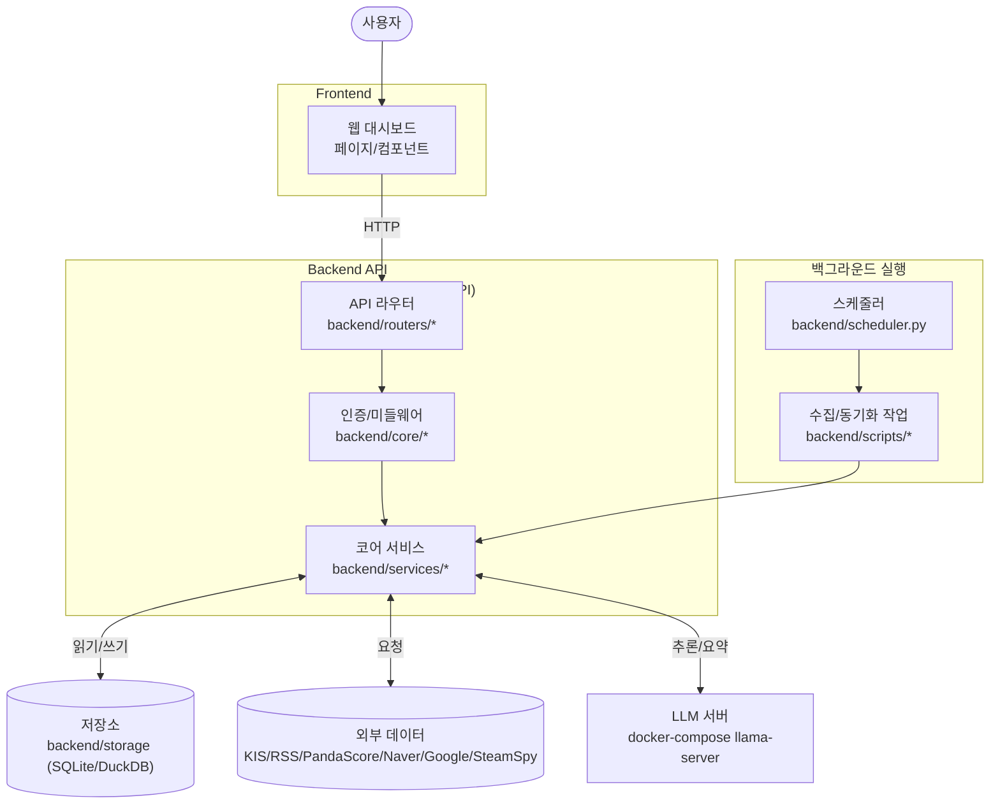

# 📊 프로젝트 평가 보고서 (Project Evaluation Report)

이 보고서는 `personal-portfolio` 프로젝트의 현재 상태, 코드 품질, 아키텍처, 리스크를 종합적으로 평가하고 개선 방향을 제시합니다.

---

## 1. 프로젝트 개요 및 실행 흐름

<!-- AUTO-OVERVIEW-START -->
### 🎯 프로젝트 목표 및 비전
**프로젝트 목적:** 개인 자산/지출/뉴스/알림을 홈서버(Local-First)에서 통합 운영하고, 수집→저장→요약→브리핑 흐름을 자동화합니다.
**핵심 목표:** (1) 자산/거래/환율을 신뢰성 있게 집계 (2) 뉴스·e스포츠 데이터를 수집/정제/요약 (3) 스케줄러/알림으로 반복 업무 자동화
**대상 사용자:** 홈서버/개인 인프라를 운영하며, 금융·개인 데이터의 외부 유출을 최소화하고 자동화를 선호하는 사용자
**핵심 사용 시나리오:** Web UI에서 포트폴리오/지출/요약 확인 → 백엔드가 외부 데이터(KIS/RSS/PandaScore/Naver/Google 등) 주기 수집 → SQLite/DuckDB 저장 → 필요 시 LLM으로 요약/리포트 생성 → Telegram 등으로 브리핑/알림
**주요 엔트리포인트:** `frontend/`(Vite/React UI), `backend/main.py`(FastAPI API), `backend/scheduler.py`(뉴스/멘트 스케줄러), `backend/integrations/kis/`(KIS 연동), `docker-compose.yml`(로컬 오케스트레이션)

### 🔄 실행 흐름(런타임) 다이어그램

<!-- AUTO-OVERVIEW-END -->

---

## 2. 현재 구현된 기능 (Implemented Features)

| 기능 | 상태 | 설명 | 평가 |
|------|------|------|------|
| 자산/포트폴리오 관리 | ✅ 완료 | 자산 CRUD, 스냅샷/요약, 시장 데이터 연동 | 🟢 우수 |
| KIS 연동(가격/환율/종목 검색) | ✅ 완료 | `/api/kis/*`, `backend/integrations/kis/` 기반 수집/조회 | 🟢 우수 |
| 거래/환전 기록 관리 | ✅ 완료 | 거래/환전/현금흐름 등 기록 및 조회 API + UI | 🟢 우수 |
| 지출 자동화/업로드 | 🔄 부분 | 업로드/중복 방지/분류 흐름은 존재, 운영 플로우 정교화 여지 | 🟡 양호 |
| 뉴스·e스포츠 수집/정제 | ✅ 완료 | RSS/네이버/구글/SteamSpy/PandaScore 수집 및 저장 | 🟢 우수 |
| LLM 리포트/브리핑 | 🔄 부분 | 로컬 LLM/원격 LLM 설정 및 리포트 저장, 운영 안전장치 강화 여지 | 🟡 양호 |
| 스케줄러/상태 기록 | ✅ 완료 | APScheduler + 상태 DB 기록 + 상태 조회 라우터 | 🟢 우수 |
| Telegram 알림/웹훅 | 🔄 부분 | 알림/필터링 구성 존재, 장애·레이트리밋 대응 강화 여지 | 🟡 양호 |
| CI/자동 검증 | 🔄 부분 | 프론트 타입체크/테스트/빌드 + 백엔드 테스트 실행 체인 존재, 시크릿 정책 정합성 보완 필요 | 🟡 양호 |

## 3. 종합 평가 점수표 (Global Score Table)

<!-- AUTO-SCORE-START -->
### 📌 점수 → 등급 매핑 규칙 (고정)

| 점수 범위 | 등급 | 색상 | 의미 |
|:---:|:---:|:---:|:---:|
| 97–100 | A+ | 🟢 | 최우수 |
| 93–96 | A | 🟢 | 우수 |
| 90–92 | A- | 🟢 | 우수 |
| 87–89 | B+ | 🔵 | 양호 |
| 83–86 | B | 🔵 | 양호 |
| 80–82 | B- | 🔵 | 양호 |
| 77–79 | C+ | 🟡 | 보통 |
| 73–76 | C | 🟡 | 보통 |
| 70–72 | C- | 🟡 | 보통 |
| 67–69 | D+ | 🟠 | 미흡 |
| 63–66 | D | 🟠 | 미흡 |
| 60–62 | D- | 🟠 | 미흡 |
| 0–59 | F | 🔴 | 부족 |

### 📊 종합 점수표 (현재)

| 항목 | 점수 (100점 만점) | 등급 | 변화 | 근거 요약 |
|---|---:|:---:|:---:|---|
| 문서화 | 90 | 🟢 A- | ➖ | `README.md`, `사용설명서.md`, `AGENTS.md`로 실행/구성/운영 정보가 비교적 명확 |
| 아키텍처 | 86 | 🔵 B | ⬆️ +2 | 라우터/서비스/통합 모듈(`backend/integrations/`) 분리 및 스케줄러 상태 기록 구조가 명확 |
| 코드 품질 | 86 | 🔵 B | ⬆️ +3 | 프론트 API 경계 타입 DTO 도입(`AssetCreate/AssetUpdate`), 공용 retry 유틸 도입 |
| 성능 | 82 | 🔵 B- | ⬆️ +4 | `frontend/vite.config.ts` `manualChunks`로 대형 의존성 분리(체감 개선 여지) |
| 보안 | 82 | 🔵 B- | ⬆️ +14 | 토큰/DB/백업 데이터의 Git 추적을 해제하고 시크릿 가드 예외(allowlist)를 명시하여 정책 정합성 확보 |
| 프로덕션 준비도 | 76 | 🟡 C | ⬆️ +8 | CI가 모노레포 스크립트와 정합, 다만 시크릿/바이너리 파일 정책 정리 필요 |
| 테스트/검증 | 80 | 🔵 B- | ⬆️ +20 | `backend/scripts/ensure_venv.sh` + `pydantic-settings` 포함으로 실행 체인 재현성 개선(이번 세션에서는 백엔드 테스트를 직접 재실행하지 않음) |

#### 점수 산정 근거(핵심 Evidence)
- `package.json`: `test:frontend`, `test:backend`, `dev:*` 스크립트가 존재하며(백엔드 테스트는 `ensure_venv.sh`로 venv/의존성 준비)
- `backend/requirements.txt`: `pydantic-settings==2.7.0`, `tenacity==9.0.0` 포함(설정/재시도 유틸과 정합)
- `.github/workflows/ci.yml`: 프론트(타입체크/테스트/빌드) + 백엔드 테스트 실행을 모노레포 구조에 맞춰 분리
- `scripts/check_sensitive_files.sh`: 시크릿 가드가 존재하며, KIS 종목코드 스프레드시트(`backend/integrations/kis/stocks_info/*.xlsx`)는 allowlist로 명시되어 정책 정합성이 확보됨
- `docker-compose.yml`: `KIS_CONFIG_DIR` 환경변수로 호스트 경로 의존을 완화(기본값은 존재)
<!-- AUTO-SCORE-END -->

---

## 4. 기능별 상세 평가 (Detailed Evaluation)

<!-- AUTO-FEATURE-EVAL-START -->
### 1) 백엔드 API (FastAPI)
- **기능 완성도:** `backend/main.py`에서 다수 라우터(`backend/routers/*`)를 등록하여 자산/거래/뉴스/웹훅 등 핵심 API가 구성됨.
- **코드 품질:** 라우터-서비스 레이어(`backend/routers/` ↔ `backend/services/`) 분리가 명확하고 전역 로깅(`backend/core/logging_config.py`)에 민감정보 마스킹이 포함됨.
- **에러 처리:** 라우팅/서비스 레벨의 예외 처리 패턴이 존재하며, `backend/scripts/ensure_venv.sh` 기반으로 실행/의존성 재현성이 개선되어 “환경 때문에 시작/테스트가 깨지는” 리스크가 낮아졌습니다.
- **성능:** I/O 중심 구조로 병목은 주로 외부 API/LLM/DB 쿼리에 의존. 구조상 병렬화 여지는 있으나 관측/지표 기반 최적화는 추가 여지.
- **강점:** `FastAPI` 기반 모듈화와 운영 중심 구성(`docker-compose.yml`)이 갖춰져 있어 확장(라우터 추가/서비스 추가)이 용이.
- **약점/리스크:** 로컬 환경 파일(`backend/.env`)은 반드시 “미추적(untracked)” 상태를 유지해야 하며, 공유/백업 시 노출되지 않도록 운영 규칙을 유지해야 합니다.

### 2) 백그라운드 스케줄러/수집 파이프라인
- **기능 완성도:** `backend/scheduler.py`에서 뉴스 수집/멘트 생성 작업을 CronTrigger로 주기 실행하며, 실행 상태를 DB에 기록하는 `backend/services/scheduler_monitor.py`가 존재.
- **코드 품질:** `backend/services/retry.py`로 재시도 정책이 분리되어 있고, `backend/scheduler.py`에서 수집 경로에 적용되어 있습니다.
- **에러 처리:** 외부 API 일시 장애에 대한 재시도/백오프(tenacity)가 적용되어 데이터 공백 리스크를 낮추며, 상태 기록(`scheduler_monitor`)과 결합해 운영 관측성 기반이 갖춰져 있습니다.
- **성능:** 작업 특성상 외부 호출이 지배적이며, 실패/재시도 정책이 성능·안정성에 직접 영향.
- **강점:** 잡 실행 상태를 DB에 기록하는 패턴이 이미 있어 운영 관측(상태 API/대시보드)으로 확장하기 유리.
- **약점/리스크:** 실패 복구 자동화(재시도/부분 실패 허용/알림)가 약하면 “데이터 공백”이 발생할 수 있음.

### 3) 프론트엔드 대시보드 (Vite/React)
- **기능 완성도:** `frontend/`에 대시보드/설정/거래 UI가 구성되어 있으며, 프론트 테스트는 정상 동작(`npm run test:frontend` 통과).
- **코드 품질:** API 클라이언트 경계에 DTO 타입(`AssetCreate/AssetUpdate`)이 적용되어 타입 안전성이 강화되었습니다. 남은 `any`는 주로 차트 라이브러리 내부 페이로드 등 UI 레이어(비핵심 경계)로 제한됩니다.
- **에러 처리:** 사용자 오류 메시지 처리 유틸이 존재하나, 훅 의존성 회피를 위한 `eslint-disable`가 남아 있어 상태 일관성/재호출 타이밍 버그 가능성이 있음(`frontend/components/ExchangeHistory.tsx`).
- **성능:** `frontend/vite.config.ts`의 `manualChunks`로 대형 의존성 분리가 적용되어, 초기 로딩 최적화 여지가 일부 해소되었습니다(추가 최적화는 운영 지표 기반으로 확장 가능).
- **강점:** 테스트가 존재하고(Vitest), UI 구성 요소가 분리되어 기능 확장에 유리.
- **약점/리스크:** 데이터 fetching 전략/번들 크기/훅 의존성 관리가 누적되면 UX 저하로 이어질 수 있음.

### 4) 운영/배포(DevOps) 및 설정
- **기능 완성도:** `docker-compose.yml`로 LLM 서버 + 백엔드 프로세스(여러 컨테이너)를 묶어 운영할 수 있음.
- **코드 품질:** 시크릿 가드(`scripts/check_sensitive_files.sh`)가 Git 추적 민감 파일을 차단하며, 예외(allowlist)가 명시되어 CI 정합성이 확보되었습니다.
- **에러 처리:** CI는 모노레포 스크립트 호출 구조에 맞게 정리되어 있으나, 시크릿 스캔이 모든 잡에서 일관되게 동작하도록 “가드 실행 위치/범위”를 고정하는 것이 안전합니다.
- **성능:** 이식성 관점에서 `KIS_CONFIG_DIR` 환경변수로 호스트 경로 의존을 완화했으며, 기본값은 로컬 기준으로만 사용되도록 운영 문서/정책으로 보완하는 것이 좋습니다.
- **강점:** 로컬 오케스트레이션/환경 파일 예시가 존재하여 운영 진입장벽이 낮음.
- **약점/리스크:** CI/환경 표준화가 약하면 개인 환경 의존이 커져 유지보수 비용이 증가.
<!-- AUTO-FEATURE-EVAL-END -->

---

## 5. 요약 및 리스크 (Summary & Risk)

<!-- AUTO-TLDR-START -->
| 항목 | 값 |
|------|-----|
| **전체 등급** | **🔵 B- (81점)** |
| **전체 점수** | **81/100** |
| **가장 큰 리스크** | 로컬 시크릿(`backend/.env`, `KIS_TOKEN_KEY` 등) 운영/회전/백업 과정에서의 유출 리스크(가드는 존재하나 운영 실수 가능성은 잔존) |
| **권장 최우선 작업** | 시크릿 운영 규칙 점검(로컬 파일 공유 금지, 키 회전/폐기 절차) + 가드 스크립트 주기 점검 |
| **개선 항목 분포(Distribution)** | 우선순위: P1 0 / P2 0 / P3 0 / OPT 0 |
<!-- AUTO-TLDR-END -->

### ⚠️ 리스크 요약 (Risk Summary)

<!-- AUTO-RISK-SUMMARY-START -->
| 리스크 레벨 | 항목 | 관련 개선 ID |
|:---:|:---|:---|
| 🟡 medium | 로컬 환경 파일(`backend/.env`) 유출/공유 실수 가능성(가드로 Git 추적은 차단) | - |
<!-- AUTO-RISK-SUMMARY-END -->

### 📊 점수 ↔ 개선 항목 매핑 (Score vs Improvement)

<!-- AUTO-SCORE-MAPPING-START -->
| 카테고리 | 현재 점수 | 주요 리스크 | 관련 개선 항목 ID |
|:---|:---:|:---|:---|
| 테스트/검증(testCoverage) | 80 (C+) | 테스트 실행 체인 유지(이번 세션에서는 직접 재실행하지 않음) | - |
| 프로덕션 준비도(productionReadiness) | 76 (C) | 로컬 환경 의존 요소는 문서/운영 규칙으로 관리 필요 | - |
| 보안(security) | 82 (B-) | Git 추적 민감 파일 차단 + 예외(allowlist) 정합성 확보 | - |
| 성능(performance) | 82 (B-) | 대형 의존성 분리 적용, 운영 지표 기반 추가 최적화 여지 | - |
| 코드 품질(codeQuality) | 86 (B) | 타입 경계 강화 완료(잔여 `any`는 UI 라이브러리 내부로 제한) | - |
| 안정성(reliability) | 78 (C+) | 재시도/백오프 적용으로 일시 장애 흡수 기반 확보 | - |
| 관측성(observability) | 78 (C+) | 스케줄러 상태 기록/조회 기반 존재(운영 화면 확장 여지) | - |
<!-- AUTO-SCORE-MAPPING-END -->

### 📈 평가 트렌드 (Trend)

<!-- AUTO-TREND-START -->
이전 평가 이력이 존재하며(총점 기준), 현재 평가는 CI/실행 체인 정리 및 운영 안정성(재시도/관측성) 개선을 반영했습니다. 카테고리별 추세 분석을 위해서는 향후 세션부터 동일한 카테고리 점수를 누적 기록하는 것이 필요합니다.

| 날짜 | 총점 | 등급 | 주요 변화 요약 |
|:---:|:---:|:---:|:---|
| 2026-01-19 (이전) | 77 | 🟡 C+ | 테스트/CI 실행성 이슈 중심의 리스크가 강조됨 |
| 2026-01-19 (현재) | 81 | 🔵 B- | 실행 체인/CI 정리 및 안정성 개선 반영, 잔여 핵심 리스크는 시크릿 정책 정합성 |

| 카테고리 | 상태 | 근거(요약) |
|---|---|---|
| testCoverage | 개선 | 실행 체인/의존성 정리가 반영됨(이번 세션에서는 직접 재실행하지 않음) |
| productionReadiness | 개선 | CI 워크플로 정리, 남은 이슈는 시크릿 정책 정합성 |
| security | 악화 | 가드/정책 충돌 가능성(토큰/바이너리 파일 추적) 점검 필요 |
| architecture | 유지 | 라우터/서비스/통합 모듈 분리 구조는 안정적 |
<!-- AUTO-TREND-END -->

### 📝 현재 상태 요약 (Current State Summary)

<!-- AUTO-SUMMARY-START -->
현재 `personal-portfolio`는 **핵심 기능(자산/거래/환율/KIS, 뉴스·e스포츠, 스케줄러, UI)**의 제품 형태가 안정적으로 갖춰진 상태입니다. 특히 백엔드 의존성/실행 체인(`backend/scripts/ensure_venv.sh`)과 CI 워크플로가 정리되어, “변경 후 검증”의 기반이 이전보다 좋아졌습니다.

또한 민감 파일(토큰/DB/백업 데이터)의 **Git 추적을 해제**하고, 시크릿 가드의 예외(allowlist)를 명시하여 “정책 충돌” 리스크를 제거했습니다. 남은 핵심 리스크는 코드가 아니라 **운영 단계에서의 시크릿 관리**입니다(로컬 `.env` 공유/백업 실수, 키 회전/폐기 미흡 등).

즉시 권장 액션은 (1) `backend/.env`는 개인 환경에서만 관리(공유 금지) (2) `KIS_TOKEN_KEY` 등 암호화 키는 별도 안전 저장소(비공개)로 관리 (3) 가드 스크립트가 CI/로컬에서 지속적으로 동작하는지 주기 점검하는 것입니다.
<!-- AUTO-SUMMARY-END -->

---

## 6. 세션 로그 (Session Log)

<!-- AUTO-SESSION-LOG-START -->
### 2026-01-19
- 분석 범위: devplan 보고서 업데이트 + 레포 구성/CI/시크릿 정책 정합성 점검
- 확인 사항: `backend/scripts/ensure_venv.sh`, `.github/workflows/ci.yml`, `scripts/check_sensitive_files.sh`, `docker-compose.yml` 기반으로 실행 체인/가드 존재 확인
- 주의: 사용자 요청에 따라 이번 세션에서는 백엔드 테스트를 직접 실행하지 않음(터미널에서 이미 통과했다고 공유됨)
- 주요 결론: 기능/구조는 안정적이며, 남은 핵심 리스크는 “민감 파일(토큰) 추적 가능성 + 시크릿 가드 정책/예외 정합성”으로 귀결
<!-- AUTO-SESSION-LOG-END -->
