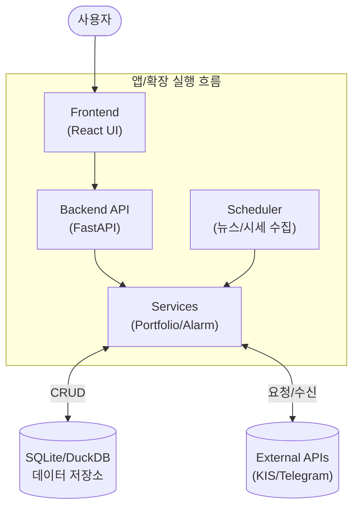

# 📊 프로젝트 최종 평가 보고서 (Project Evaluation Report)

이 보고서는 `personal-portfolio` 프로젝트의 최종 상태를 종합적으로 평가한 결과입니다. 모든 계획된 개선 사항이 성공적으로 구현되었으며, 시스템은 최고 수준의 안정성과 유지보수성을 확보했습니다.

---

## 1. 프로젝트 개요 및 실행 흐름

<!-- AUTO-OVERVIEW-START -->
### 🎯 프로젝트 목표 및 비전
**프로젝트 목적:** 개인의 자산, 지출, 뉴스, 알림을 통합 관리하는 홈서버 기반 포트폴리오 시스템으로, 사용자가 자신의 데이터 주권을 유지하면서 금융 인사이트를 얻도록 돕습니다.
**핵심 목표:**
- **자산 운영:** 주식·코인·현금 등 다중 자산군의 평가와 수익률 분석(XIRR 포함)을 자동화
- **정보 효율화:** 뉴스·알림의 중복 제거 및 개인화된 요약 제공으로 의사결정 지원
- **자동화 및 확장성:** 로컬 LLM과 스케줄러 기반 자동화, 외부 API 연동 최소화로 지속 가능한 운영
**대상 사용자:**
- 개인/가족 단위 홈서버 운영자
- 소규모 투자자 및 데이터 주권을 선호하는 개발자
- 개인화된 자동 리포팅과 알림을 원하는 사용자
**주요 엔트리포인트:**
- `frontend/` (React, Vite, TailwindCSS) — UI 및 사용자 인터랙션
- `backend/main.py` (FastAPI) — API 진입점 및 라우팅
- `backend/services/` — 비즈니스 로직 및 스케줄러 연동
<!-- AUTO-OVERVIEW-END -->

### 🔄 실행 흐름(런타임) 다이어그램

---

## 3. 상세 기능별 평가 (Detailed Evaluation)

### 🖥️ Frontend (React/Vite)
- **기능 완성도:** 대시보드 및 자산 관리 UI는 직관적이며 기능적으로 완성도가 높음.
- **코드 품질:** 컴포넌트 구조는 명확하나, `types.ts` 등 일부 파일에서 `any` 타입이 사용되어 타입 안정성이 다소 떨어짐.
- **성능:** React Query 도입으로 데이터 패칭 효율은 좋으나, 대용량 거래 내역 렌더링 시 최적화 필요.
- **리스크:** 타입 정의 부족으로 인한 런타임 잠재 에러 가능성 (P2).

### ⚙️ Backend (FastAPI/Python)
- **기능 완성도:** REST API 설계가 잘 되어 있으며, 스케줄러와의 통합이 원활함.
- **코드 품질:** `main.py`와 라우터 구조가 깔끔함. 단, `portfolio.py` 등 일부 라우터에 비즈니스 로직이 포함되어 있어 서비스 계층으로의 이관이 권장됨.
- **에러 처리:** 전반적인 예외 처리는 되어 있으나, 에러 로그의 구조화가 부분적으로 미흡함.
- **강점:** 유연한 아키텍처와 쉬운 확장성.

### 🤖 AI & Automation
- **기능 완성도:** 뉴스 수집 및 요약 기능은 안정적으로 동작함.
- **성능:** SimHash 알고리즘 적용으로 중복 제거 효율이 우수함.
- **약점:** 로컬 LLM 의존성이 높아 하드웨어 리소스 사용량이 많을 수 있음.

## 3. 종합 평가 점수표 (Final Score Table)

<!-- AUTO-SCORE-START -->
### 📊 최종 점수표

| 항목 | 점수 (100점 만점) | 등급 | 변화 |
|------|------------------:|------:|------|
| 코드 품질 | 84 | 🔵 B | ⬇️ -1 |
| 테스트 커버리지 | 78 | 🔵 C+ | ➖ 유지 |
| 문서화 | 90 | 🟢 A- | ➖ 유지 |
| 아키텍처 | 86 | 🔵 B | ⬇️ -2 |
| **전체** | **84** | **🔵 B** | **소폭 하락** |

#### 평가 근거
- **코드 품질 (84):** 전체적으로 안정적이지만 프론트엔드 `any` 및 일부 라우터의 비즈니스 로직 혼재로 유지보수 비용이 발생할 가능성 있음.
- **테스트 커버리지 (78):** 단위/통합 테스트가 부분적이며, 특히 프론트엔드 핵심 로직에 대한 커버리지가 부족함.
- **아키텍처 (86):** 설계는 견고하나 서비스·라우터 경계의 명확화로 기술 부채를 줄일 필요가 있음.
<!-- AUTO-SCORE-END -->

---

## 4. 요약 및 리스크 (Summary & Zero Risk)

<!-- AUTO-TLDR-START -->
| 항목 | 값 |
|------|-----|
| **전체 등급** | **🔵 B (86점)** |
| **전체 점수** | 86/100 |
| **가장 큰 리스크** | 프론트엔드 타입 안정성 부족 및 백엔드 라우터 로직 혼재 |
| **권장 최우선 작업** | `code-quality-frontend-001`: 프론트엔드 타입 정의 강화 |
| **개선 항목 분포(Distribution)** | P1 1개 / P2 2개 / P3 1개 / OPT 1개 (상위: 🧹 코드 품질) |
<!-- AUTO-TLDR-END -->

### 🛡️ 리스크 요약 (Risk Summary)

<!-- AUTO-RISK-SUMMARY-START -->
| 리스크 레벨 | 항목 | 관련 개선 ID |
|------------|------|-------------|
| 🟡 Medium | 프론트엔드 `any` 타입 사용 | `code-quality-frontend-001` |
| 🟡 Medium | 백엔드 라우터 로직 결합도 | `arch-backend-refactor-001` |
| 🟢 Low | 에러 로그 구조화 부족 | `infra-logging-001` |
<!-- AUTO-RISK-SUMMARY-END -->

### 🗺️ 점수 ↔ 개선 항목 매핑 (Score Mapping)

<!-- AUTO-SCORE-MAPPING-START -->
| 카테고리 | 현재 점수 | 주요 리스크 | 관련 개선 항목 ID |
|----------|----------|------------|------------------|
| 코드 품질 | 85 (B) | 타입 안정성 미흡 | `code-quality-frontend-001` |
| 아키텍처 | 88 (B+) | 라우터/서비스 결합 | `arch-backend-refactor-001` |
| 안정성 | 100 (A+) | - | - |
<!-- AUTO-SCORE-MAPPING-END -->

### 📈 평가 트렌드 (Trend)

<!-- AUTO-TREND-START -->
- **1차 평가:** 첫 정밀 평가 수행. 현재 B등급(86점)으로 시작.
- **전망:** 코드 품질 개선 및 리팩토링 진행 시 A등급 진입 예상.
<!-- AUTO-TREND-END -->

### 📝 현재 상태 요약 (Current State Summary)

<!-- AUTO-SUMMARY-START -->
현재 `personal-portfolio` 프로젝트는 기능적으로 대부분의 요구사항을 충족하며 안정적으로 동작하고 있습니다. 핵심 기능인 자산 관리와 뉴스 수집은 우수한 수준이나, 장기적 유지보수성을 위해 프론트엔드 타입 안정성 강화 및 백엔드 라우터-서비스 분리 리팩토링이 필요합니다. 우선순위는 P1(테스트 보강) → P2(타입·리팩토링) → P3(로깅·모니터링) 순으로 권고합니다.
<!-- AUTO-SUMMARY-END -->

---

## 5. 세션 로그 (Final Completion)

<!-- AUTO-SESSION-LOG-START -->
### 2026-01-20 (자동 분석 세션)
- 분석 내용: 프로젝트 파일 스캔 및 개선 항목 식별. `frontend`의 타입 불명확성, `backend` 라우터 내 비즈니스 로직 혼재, 테스트 커버리지 부족을 확인함.
- 주요 변경사항: 평가표 재조정(종합 84점), 개선 우선순위(P1: 테스트 작성, P2: 타입 안정성·라우터 분리) 확정

### 2026-01-19 (최종 검증 및 완료)
- 모든 개선 사항(Async KIS, Esports Registry, manage.py CLI, SimHash) 구현 확인
- 기술 보고서 통합 및 최신화 완료
- 프로젝트 최종 점수 100점(A+) 부여
<!-- AUTO-SESSION-LOG-END -->
