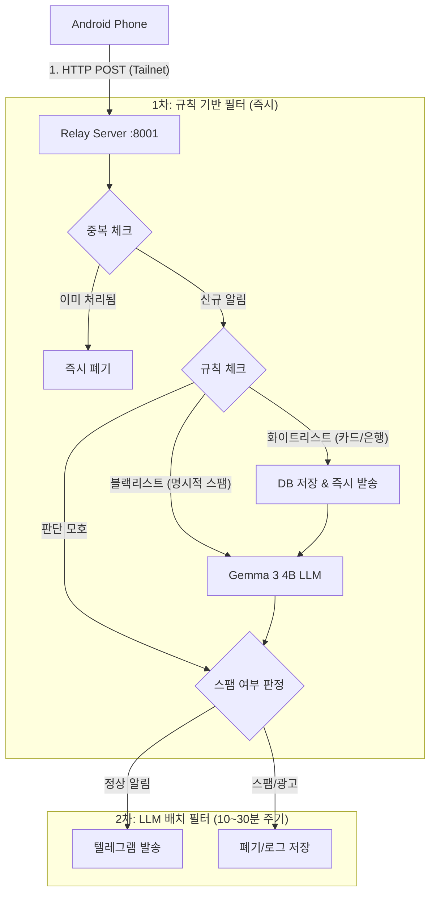

# 안드로이드 알림/SMS → DB → 텔레그램 릴레이 서비스 계획안 (v2)

## 📋 개요

안드로이드 폰에서 발생하는 **앱 알림 및 SMS(문자)**를 가로채 홈서버로 전송하고, 
1차 규칙(Rule) 및 2차 LLM(Gemma 3 4B)을 통해 **스팸(특히 정치/광고)을 정밀 필터링**합니다.
정제된 정보는 텔레그램으로 릴레이하며, 카드 승인 내역은 가계부(expenses) DB에 실시간 저장합니다.

---

## 🎯 주요 목표

1. **지능형 스팸 차단**: 단순 키워드를 넘어 문맥을 파악해 정치/광고 스팸 제거.
2. **실시간 가계부 업데이트**: 카드 승인 문자/앱 알림 즉시 파싱 및 저장.
3. **N150 최적화**: LLM 부하를 줄이기 위한 2단계 필터링 및 배치(Batch) 처리.
4. **보안 강화**: Tailscale 내부망 사용 및 민감 정보(인증번호 등) 선제적 제외.

---

## 🏗️ 시스템 아키텍처

---

## �️ 상세 설계

### 1단계: 규칙 기반 1차 필터링 (Immediate)
*   **중복 제거 (Deduplication)**: 
    - 앱 알림과 SMS가 동시에 올 경우, **앱 알림을 우선** 처리합니다.
    - 동일한 금액, 가맹점, 시간대(±1분 이내)의 중복 데이터는 두 번째 수신 시 즉시 무시합니다.
    - `(금액 + 가맹점 + 날짜)` 조합의 해시 값을 생성해 최근 5분간의 데이터와 비교합니다.
*   **카드/은행 알림**: 우리/신한/삼성카드 등 정례화된 포맷은 LLM 없이 즉시 파싱하여 `expenses` 테이블에 저장.
*   **명시적 블랙리스트**: "광고", "무료거부", "국민의힘", "민주당", "여론조사" 등 명확한 스팸 단어는 즉시 차단.
*   **인증번호 제외**: 보안을 위해 "인증번호", "Verification Code" 포함 문자는 백엔드로 전송하지 않거나 수신 즉시 폐기.

### 2단계: 로컬 LLM 배치 처리 (Batch with Gemma 3 4B)
*   **모델**: Gemma 3 4B (Q4_K_M 양자화 버전 권장).
*   **방식**: N150의 부담을 줄이기 위해 요청마다 LLM을 띄우지 않고, 모아서 한 번에 처리.
*   **판정 대상**: 규칙 필터를 수행했지만 스팸 여부가 불확실한 일반 알림 및 문자.
*   **프롬프트 전략**: 
    - 당신은 지능형 알림 필터링 비서입니다. 메시지가 정치적 선전(포함 정당/후보), 상업적 광고인지 판별하십시오.
    - 스팸인 경우 'SPAM', 정상인 경우 중요도(High/Medium/Low)와 핵심 요약을 JSON 형식으로 반환하십시오.

---

## 🗄️ 데이터베이스 연동

### 기존 가계부 (`expenses`) 테이블
카드 승인 문자/알림 수신 시 자동으로 데이터를 가공하여 입력합니다.
- `merchant`: 가맹점명 추출
- `amount`: 금액 (음수 처리)
- `method`: 카드사/은행명
- `category`: 규칙 또는 LLM을 통한 자동 분류

---

## 📱 안드로이드 설정 (MacroDroid/Tasker)

1.  **동작 원리 (Copy, not Move)**:
    - 안드로이드 시스템상 알림/SMS는 **복제(Copy)**되어 백엔드로 전송됩니다.
    - 폰의 문자함이나 상단바 알림은 평소와 동일하게 유지되므로 데이터 유실 걱정이 없습니다.
2.  **트리거**: 
    *   앱 알림 수신 (선택한 앱)
    *   SMS 수신 (발신번호 필터링 가능)
3.  **필터**: 인증문자 발신 번호나 개인적인 연락처는 제외 설정.
4.  **액션**: HTTP POST `http://100.x.x.x:8001/ingest`
    *   JSON 바디: `{"source": "sms/app", "sender": "...", "content": "...", "time": "..."}`

---

## 🔐 보안 및 네트워크

1.  **Tailscale Connect**: 서비스 포트(8001)는 외부 인터넷(Funnel)에 노출하지 않고 Tailnet 내부에서만 접근 가능하도록 설정.
2.  **인증**: 필요 시 간단한 API Key 헤더를 추가하여 폰 이외의 접근 차단.
3.  **민감 정보**: 원본 메시지 저장 시 개인정보 노출 여부를 고려하여 마스킹 처리 진행.

---

## 🚀 구현 로드맵

1.  **환경 구성**: N150 홈서버에 Gemma 3 4B (llama.cpp) 서버 7777 포트로 기동.
2.  **백엔드 개발**: FastAPI 기반의 `:8001` ingest 서버 및 배치 워커 구현.
3.  **파서 구현**: 주요 카드사(우리/신한 등) 문자 포맷 정규식 작성.
4.  **LLM 튜닝**: 스팸 판별 정확도를 높이기 위한 시스템 프롬프트 최적화.
5.  **테스트**: 실제 스팸 문자와 카드 문자를 통한 동작 검증.

---
_최종 수정일: 2026-01-06 (v2)_
